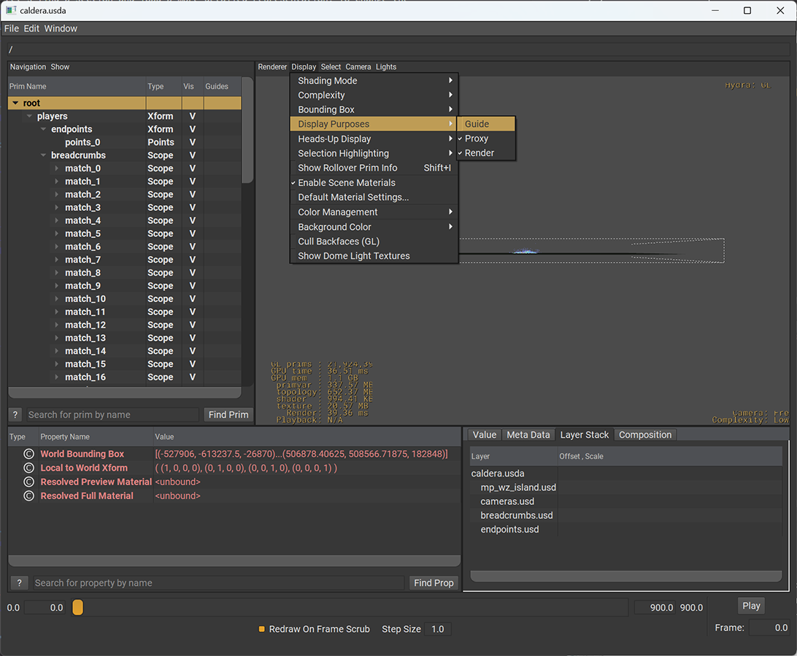
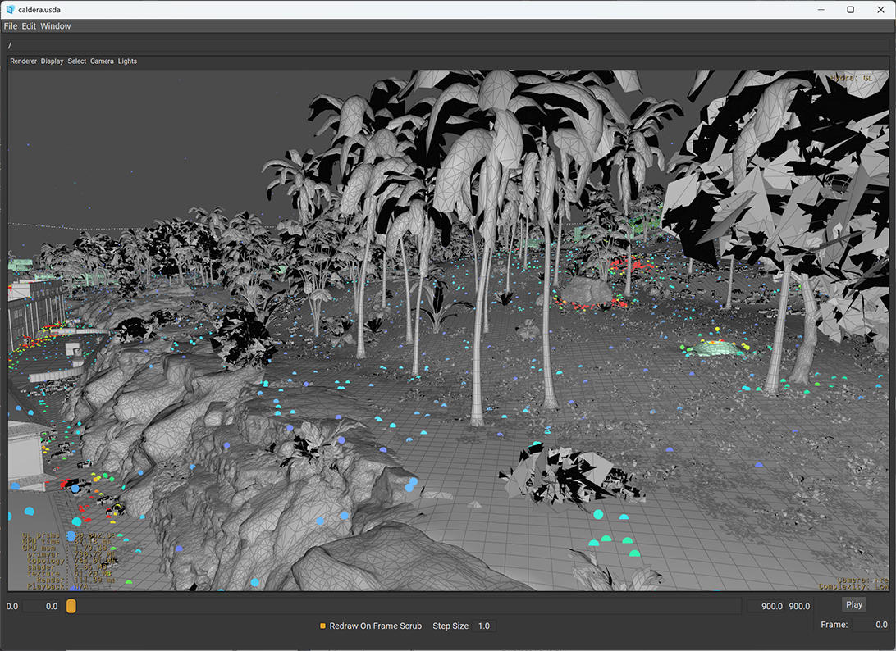

# Caldera


## Introduction

The Caldera data set is an [OpenUSD](https://openusd.org) scene containing most of the geometry found in the [Call of Duty®: Warzone™](https://www.callofduty.com/warzone) map of the same name. This is not the actual production data but rather a conversion of parts of this to the open-source USD file format.

The included data are largely the ones that are easily represented as geometry. This includes the renderable geometry but also some alternative, usually invisible representations used in other calculations. For example, we include volumes to aid in the lighting calculations or simple shapes for collision detection. Excluded are many single point entities like the place to spawn characters or complicated script-based models. We have also chosen not to include textures and materials in this release. This would add complexity and size to an already heavy scene. Our focus is on the many relationships between spatial elements to be discovered in this set more than aiming for an accurate visual representation. 

## Goals

We hope this data set release will spur academic research in areas around the construction and analysis of environmental geometry for which there were previously not replica production data at this size and scale. There has been much research in the area of image generation, and nascent work in geometric generation, but it is usually within the framing of a single asset and not about a large, inter-connected scene with complicated parenting and other, often implicit, semantic relationships. Furthermore, while there has been some interest in generating environmental spaces e.g., for use in rendering static catalog scenes, there has not been as much work devoted to editing and updating those environments once they have been created. Improvements in this area could allow artists and content creators working on games to focus more on the creative work of bringing their ideas to life and less on the mechanical operations of repeatedly moving instances, readjusting adjacent resting objects, manually placing nodes for gameplay support, and so on. 

## License

This data set is released under the terms of the Activision Non-Commercial Use License Agreement. Please see LICENSE.md for more details.

## Acknowledgments

The original Caldera map was primarily authored by the team at [Raven Software](https://www.ravensoftware.com), with help from [Beenox](https://beenox.com/), [High Moon Studios](https://www.highmoonstudios.com/), and the broader Call of Duty teams at [Activision](https://www.activision.com/).


The Caldera data set release is supported by Koen Vroeijenstijn, Mathew Varghese, Xav de Matos, Senwhaa Lim, Michael Vance, and Natasha Tatarchuk.

Thank you to members of staff and faculty at Pixar, NVIDIA, SideFX, and Stanford for providing early feedback on the data set.

## Contact

Please use the associated issues tracker to submit an inquiry.

## Scene Settings

Up axis: Z  
Units: Inches  

## Statistics

The relevant portion of the scene covers approximately 2 by 2 miles and contains roughly 17.5 million primitives with over 2 billion points altogether. 

## Getting Started

Here are some quick steps to start exploring the data. These steps are shown in [USDView](https://docs.omniverse.nvidia.com/usdview/latest/quickstart.html), but should translate to other tools.

From the directory where you cloned the repository or extracted the release archive, run:

```
usdview caldera.usda
```

This starting point should load nearly instantly, as it loads a very lightweight representation of the scene by default. This should bring up a USDView window similar to the one below:


The gray boxes in the center are part of the scene annotations, they are not used when rendering the map. Let’s hide them. In USDView, this is done by toggling the "guide" display purposes in the view menu Display, Display Purposes:



Now you should see the entire scene represented as proxies, and a collection of points. We'll get back to those points later, first we explore the geometry. Let's find a section and load a more detailed representation. To change the viewpoint, use the Alt key and the mouse buttons to navigate the view.  The USD scene also defines several cameras to get a better look. Start by looking through ```/cameras/map_capital_square```. From the view's menu, choose Camera, Select Camera, map_capital_square. This should show you a very rough version of the geometry in the 'capital' section. 


The next thing is to select a "primitive' in the outline view. Primitives are just nodes addressed by a path. Select the prim ```/world/mp_wz_island/mp_wz_island_paths/mp_wz_island_geo/map_capital```. You can do this by browsing the tree to find this path, or paste the full path into the address bar at the top.

If you look at the metadata pane of USDView with this prim selected, you will see a "district LOD" variant field. Here you can choose how this part of the scene is represented. Currently this is set to "proxy" which is a crude polygon soup we created as a proxy. Go ahead and switch that to "full":


This will take a while as it loads all the geometry in this branch of the scene graph and replaces the poly-soup primitive with the real geometry and all the primitives representing the scene. If you zoom out a bit, you'll notice the ground (the purple geometry) is still pretty rough. The terrain is defined in a different part of the scene.


To load the terrain, select:

```
/world/mp_wz_island/mp_wz_island_paths/mp_wz_island_geo/st_main/st_o
```

And select 'full' for the LOD variant here as well:


This jumps to the highest representation of the terrain. This includes the clutter (all of the small items like grass placed on the terrain, represented by a point instance). If the small details like grass and trees don't show up at this point, it might be because the 'render' purpose is hidden. The clutter is tagged with this purpose to make it easy to hide these when they slow the scene rendering down too much. To show them, make sure you have Display, Purpose, Render checked.

We have now loaded all the details we have available for this section of the map. Included in the data set is also a [Python](https://python.org) file (```caldera.py```) containing an example of how to do several of these things in script. This is how the caldera.usd was generated from ```map_source/mp_wz_island.usd```. To just inspect the data though python, you can install the OpenUsd python bindings through [Pip](https://pypi.org/project/usd-core/).

## Player Data

Let's return to the point data we saw earlier. In addition to the scene geometry, we have included two types of player data. These are represented as point clouds when loading the Caldera USD file. Let's hide the scene geometry to more easily explore these. In the outline, collapse the tree until just the players, cameras and world primitives are visible. Now toggle the visibility of the world branch. This will hide all the geometry and leave just the points.


The first set of data to look at lives under ```/players/endpoints/points_0```. This primitive contains one million points representing the location where players ended a match. The points store a position, but also a color and a time attribute. The ```caldera.py``` example shows how to access these programmatically. 


The time attribute was captured from the actual matches and represents the time from the start of the match to when the match ended for each player (the value varies per point).

The color is generated by post processing, as an example of how you can visualize this data. The color represents the density of the point cloud with red representing areas where lots of players ended the match and blue representing sparser locations.

There is another point cloud in the set, under the breadcrumbs primitive. You can hide the endpoints but still nothing will show up. The breadcrumbs store time-varying samples and one of the animated attributes is the opacity. They all are fully transparent while the player has not spawned into the match yet. You can show points by scrubbing the timeline at the bottom of the window. The little spheres are easier to see in the Points shading mode:


Each sphere is a single player in a single match. The position of this player during the match is sampled roughly once every two seconds and stored in the position attribute. The color is again from a post process, where blue represents players at the start of their match, and red means they are close to their end of the match. This is also stored in the "life" attribute which represents start to end as a number from zero to one, with negative values meaning the player is not in the game yet, and values greater than one also mean the player is no longer in play. Not included in the release, but shown for illustration purposes, you can "connect the dots" to show the player paths. Here all the players from a single match:


## Payloads

Another way to reduce the immediate load on the system when loading the map is to not load the "payloads". We have marked many of the expensive leaf nodes as payload while leaving enough geometry to give a decent representation. For example:

```usdview –unloaded map_source/mp_wz_island.usd```

Please note that this still takes significantly longer than the method described earlier. Don't forgot to change the shading back to something other then points:


## Subsections

A third way to manage the complexity is by loading a sub-section of the map. In total there are many thousands of USD files that make up this set.

One building of the map that is fun to explore on its own is the hotel. You can load only this part of the map by starting with:

```
usdview map_source/prefabs/br/wz_vg/mp_wz_island/commercial/hotel_01.usd
```


## Terrain

All of the terrain lives in a separate branch of the tree. For many of the other prefabs, loading a subsection of the terrain is needed to get the full picture. By default, the ```caldera.usda``` will load a simplified version of the terrain for the entire map. All the children under the "st_main" prim have a variant set called "district_lod" to switch between the simple and full representation. The clutter ( small items scattered around the terrain ) have their "purpose" set to render, so they can be turned on and off with a global setting.

The full terrain is accessible through this scene:

```
map_source/prefabs/br/wz_vg/mp_wz_island/superterrrain/st_main.usd
```


The below images show examples of the simple representation and the full representation showing the clutter as an instance point cloud.




The terrain itself is divided into sections, loading a single one makes exploring easier, for example:

```
map_source/prefabs/br/wz_vg/mp_wz_island/superterrrain/season_4/st_e.terrain.usd
```


## Points of Interest

These are some fun starting points to explore more of Caldera.

### Hotel

```map_source/prefabs/br/wz_vg/mp_wz_island/commercial/hotel_01.usd```

### Restaurant

```map_source/prefabs/br/wz_vg/mp_wz_island/commercial/restaurant_01.usd```

### Capital

```map_source/prefabs/br/wz_vg/mp_wz_island/season_4/map_capital.usd```

### Airfield

```map_source/prefabs/br/wz_vg/mp_wz_island/season_4/map_airfield.usd```

### Phosphate Mine

```map_source/prefabs/br/wz_vg/mp_wz_island/season_4/map_phosphate_mine.usd```

### Beachhead

```map_source/prefabs/br/wz_vg/mp_wz_island/season_4/map_beachhead.usd```

### Power Station

```map_source/prefabs/br/wz_vg/mp_wz_island/map_tile_n/power_station_01.usd```

Copyright © 2024 Activision Publishing, Inc.
